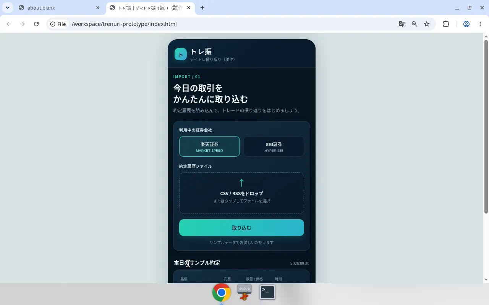
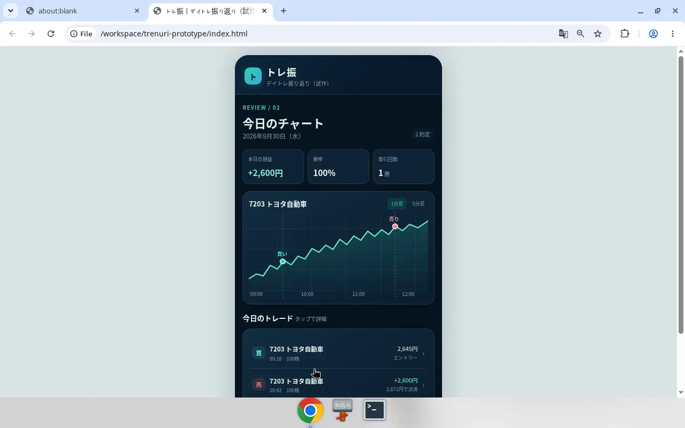
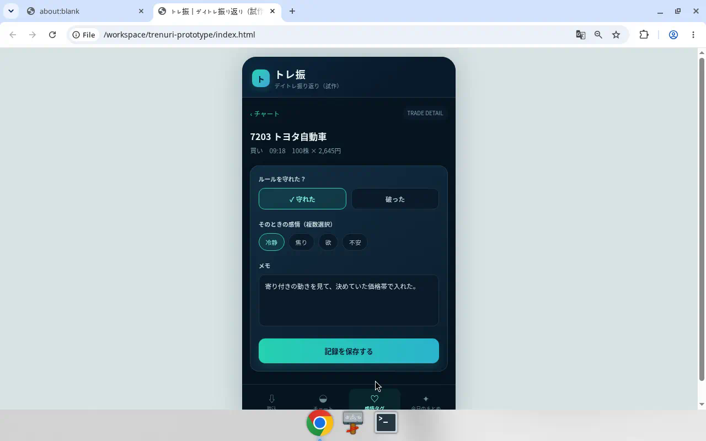
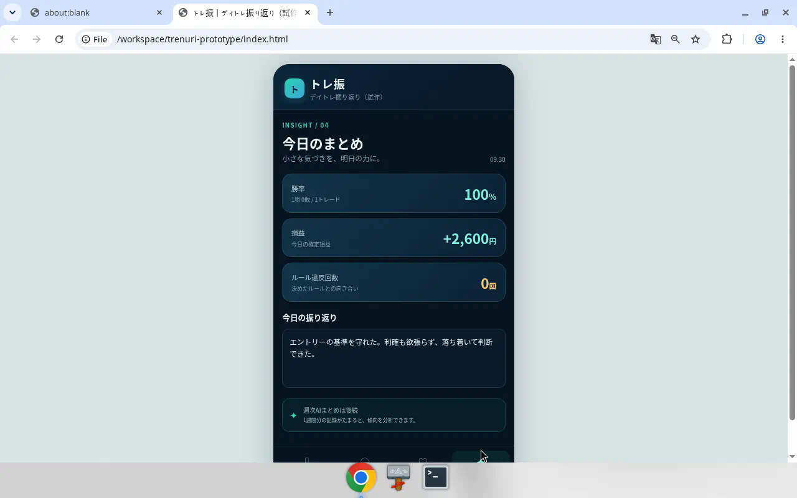

# トレ振（試作）

デイトレ振り返り仮画面です。スマホ幅の単一HTMLで、約定の取り込みからチャート、感情タグ、その日のまとめまでをサンプルデータで辿れます。証券会社への接続や約定ファイルの実解析はなく、画面と操作の仮説を確認するための試作です。実際の証券アプリではありません。

## 開き方

`index.html` をブラウザで開いてください。サーバーは不要です。

## 画面

1. 取込 — 証券会社の選択と約定履歴の取り込み
2. チャート — 当日の損益と価格の動き
3. 感情タグ — ルール遵守、感情、メモ
4. 今日のまとめ — 勝率・損益・振り返り

スクリーンショットは `shots/` にあります。

